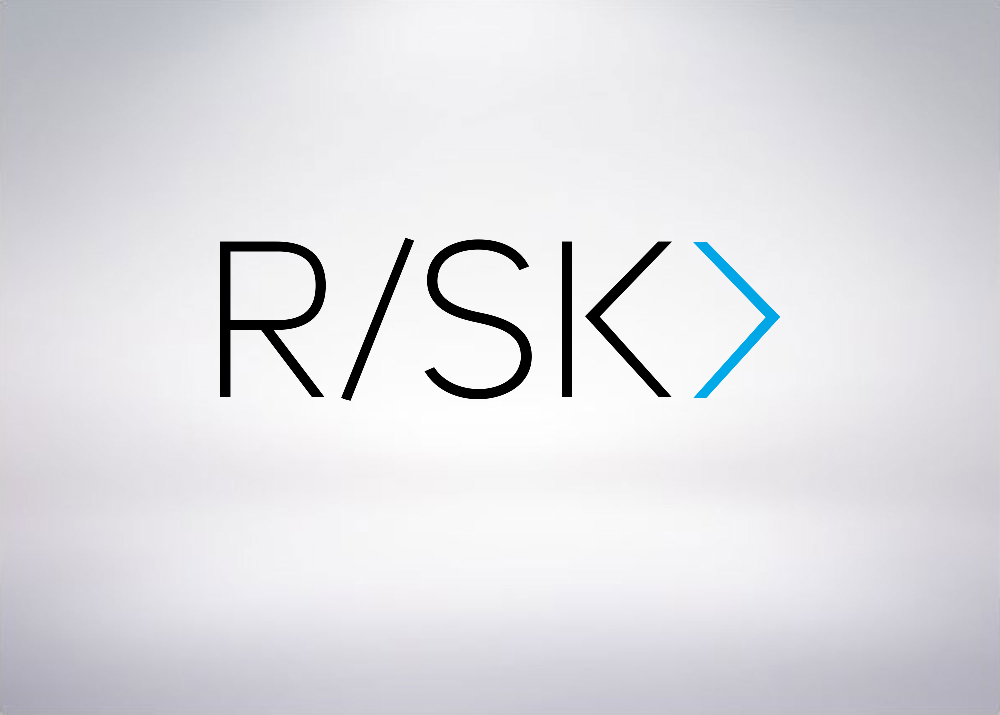

#  Skripting u bash-u (Bourne Again SHell)

## O mini kursu
Na Matematičkom fakultetu 02.12.2017. je održano kratko predavanje o skriptingu u bash-u sa ciljem da studente upozna sa mogućnostima shell jezika na *nix sistemima.

Više o organizaciji RISK možete naći [ovde](http://risk.matf.bg.ac.rs)

## Ciljevi predavanja

### Osnovni koncepti
+ Šta je shell i shell skripting
+ Zašto bash
+ Šta možete sa bash-om

### 01 osnove
+ Upoznavanje sa sintaksom bash-a
+ Osnovni koncepti kao pozivanje eksternih programa, čuvanje vrednosti u promenljive, argumenti komandne linije...
+ Pokretanje bash skripte

### 02 aritmetika
+ Par načina da vršimo aritmetičke operacije
+ Konvertovanje datuma
+ Random brojevi

### 03 grananje
+ Osnovni načini za kontrolu toka (grananje) i test program
+ Pattern matching (case)

### 04 petlje
+ Osnovni načini za kontrolu toka(ponavljanje instrukcija)
+ Malo naprednije korišćenje eksternih programa
